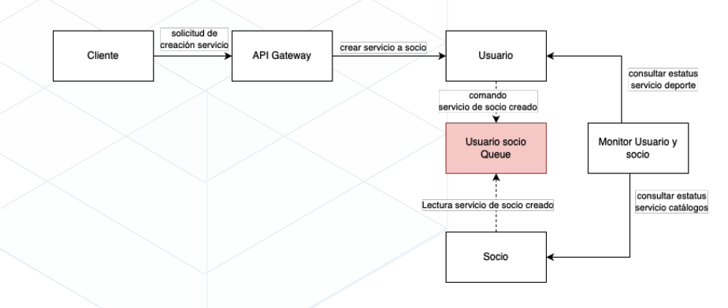

# Experimento 02 - David y Benito

https://proyectofinaluno.atlassian.net/browse/PF-51

# Registrar al menos dos servicios de un tercero
- Deportólogo 
- Entrenador 
- Alimentación *
- Transporte *
- Acompañante

# Estructura de datos para el nuevo servicio:
- Payload (IN) - POST
- Nombre del metodo: crear-servicio
```json
{
    "nombre": "",
    "descripcion": "",
    "precio": 0.00,
    "tipoServicioId":"ENUM",
    "regionId": "COL|MEX|BRA",
    "paisId": "COL|MEX|BRA",
    "ciudad": "",
    "socioId": 0
}
```
- Response (OUT) - StatusCode: 200: Exitoso, 404:Algun dato no encontrado, 500: Error interno
```json
{
    "mensaje": ""
}
```

# Base de datos
- Tabla monitor
    id
    timestamp
    timestampRecuperacion
    nombreMicroservicio
    estadoMicroservicio
    contador
- Tabla servicios
    id
    nombre
    descripcion
    precio
    tipoServicioId
    regionId
    paisId
    ciudad
    socioId



# Postman

# Puertos:
    3000-API Gateway -> 3000 <- TBD
    3001-Socios      -> 3001 <- David
    3002-Usuario     -> 3002 <- David
    3003-Sqs         -> 3003 <- Benito
    3004-Monitor     -> 3004 <- Benito

# Referencia de proyectos 
    https://github.com/MISW-4301-Desarrollo-Apps-en-la-Nube/s202314-proyecto-grupo11/tree/main

# Instrucciones
1. Para configurar permisos de uso con aws:
    aws configure

2. Para crear entorno virtual
    install --upgrade pip   
    python -m venv virtual   
    source virtual/bin/activate    

3. Para generar requirements
    pip3 freeze > requirements.txt

4. Crea contenedor
    docker build . -t <<nombre contenedor>>

5. Ejecutar contenedor
    docker run <<nombre de contenedor>>  

# Microservicios (local)
    3000-API Gateway
        http://127.0.0.1:3000/health

    3001-Socios 
        http://127.0.0.1:3001/health
        http://127.0.0.1:3001/reset

    3002-Usuario     
        http://127.0.0.1:3002/crear-servicio
        http://127.0.0.1:3002/health

    3003-Sqs        
        http://127.0.0.1:3003/health

    3004-Monitor    
        http://127.0.0.1:3004/health
        http://127.0.0.1:3004/reset
        http://127.0.0.1:3004/consultar-estatus-microservicios

# Microservicios (aws)
    3000-API Gateway
        http://{host-api-gateway}:3000/health

    3001-Socios
        http://{host-socios}/health
        http://{host-gateway}/reset

    3002-Usuarios    
        http://{host-usuarios}/crear-servicio
        http://{host-usuarios}/health

    3003-Sqs        
        http://{host-sqs}/health

    3004-Monitor    
        http://{host-monitor}/health
        http://{host-monitor}/reset
        http://{host-monitor}/consultar-estatus-microservicios